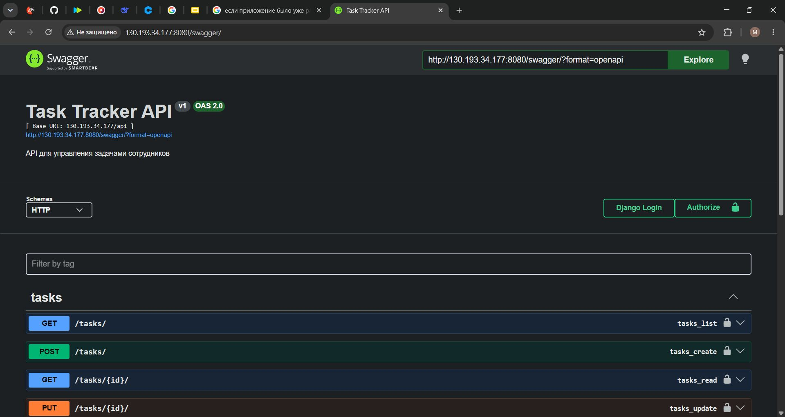
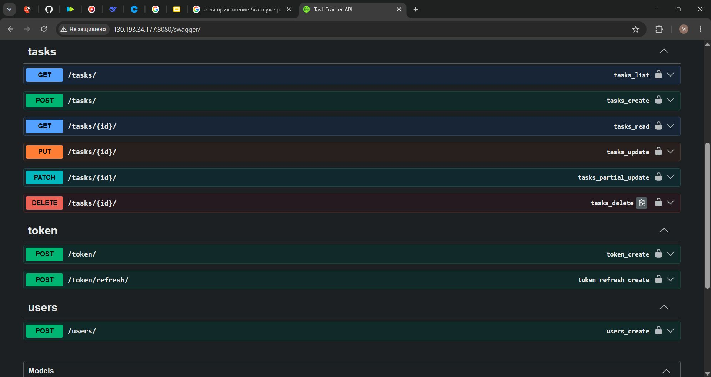
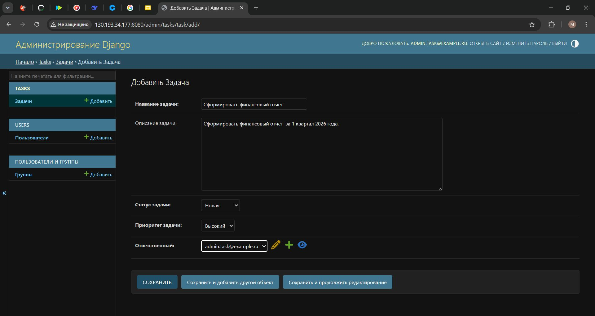
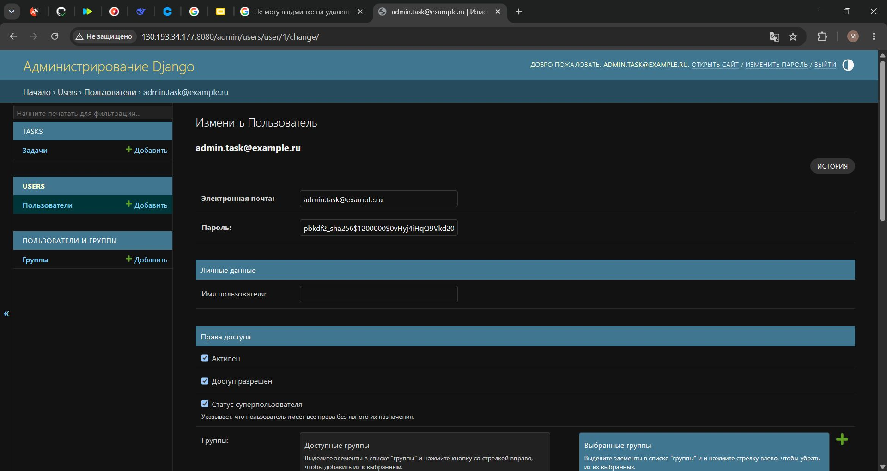
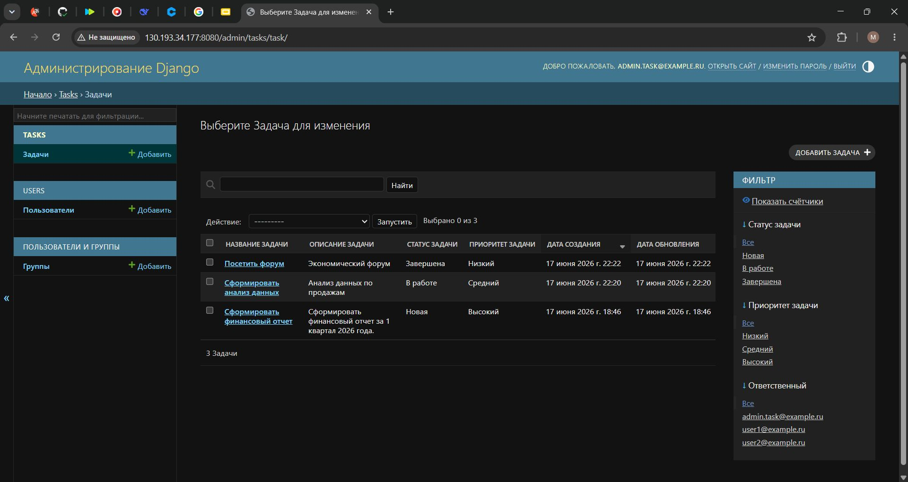
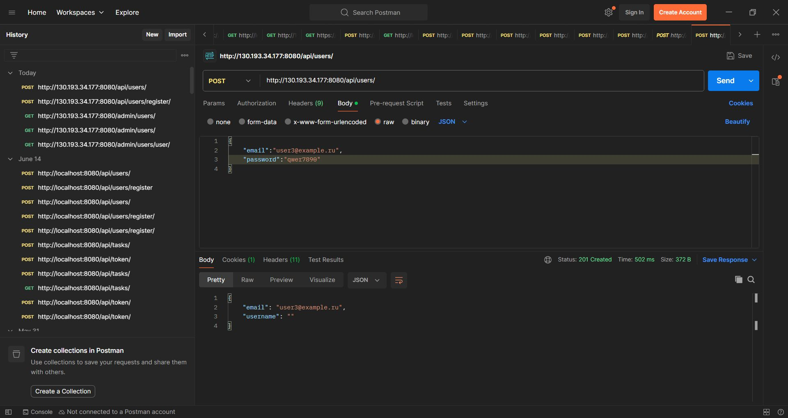
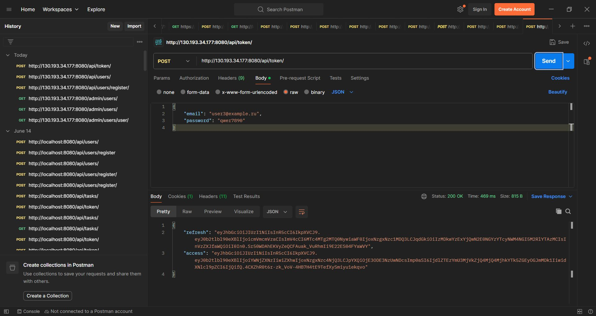
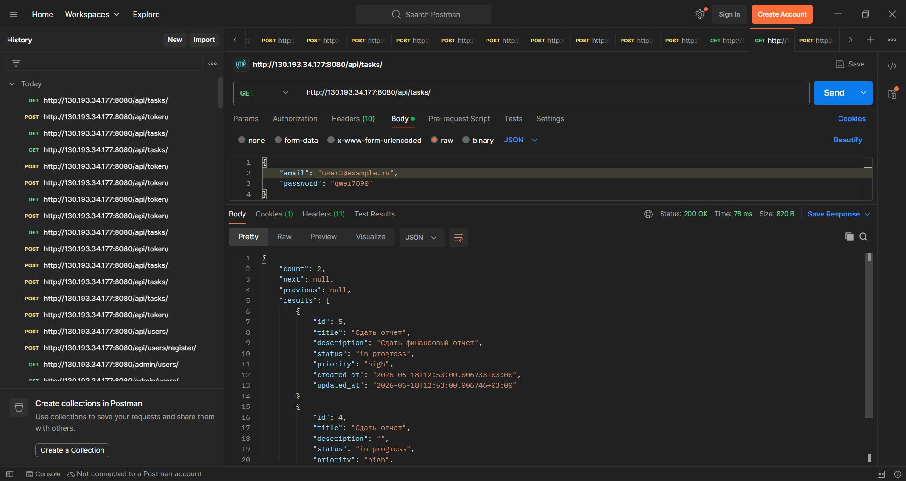
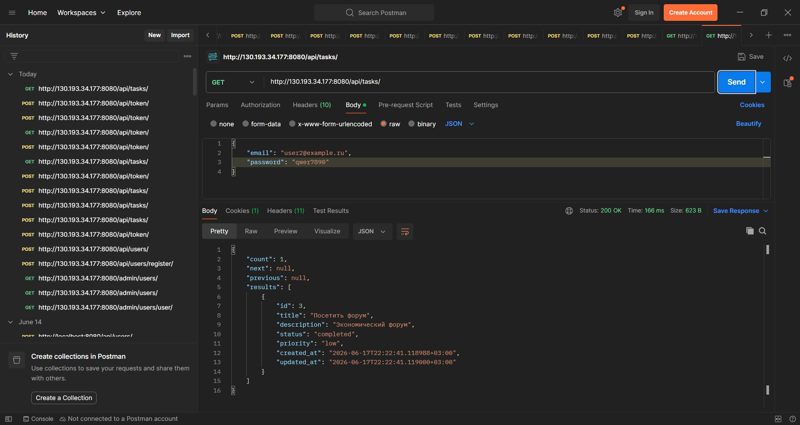
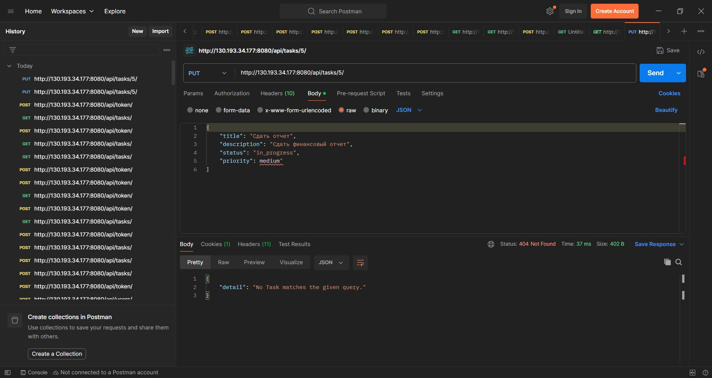

# 🚀 Task Tracker API

Бэкенд-сервис для управления задачами сотрудников. Реализован на Django REST Framework с JWT-аутентификацией,
полным CRUD, фильтрацией, пагинацией, документированным API (Swagger/ReDoc) и автоматическим деплоем через 
GitHub Actions.

---

## 📌 Содержание

- 🧩 [Описание](#описание)
- 🛠 [Технологии](#технологии)
- 🏁 [Локальный запуск](#локальный-запуск)
  - [С использованием Docker](#с-использованием-docker)
  - [Без Docker (ручной запуск)](#без-docker-ручной-запуск)
- 🔐 [Переменные окружения](#переменные-окружения)
- 🧪 [Тестирование](#тестирование)
- 📚 [Документация API](#документация-api)
- ⚙️ [CI/CD и деплой](#cicd-и-деплой)
- 📁 [Структура проекта](#структура-проекта)
- 📊 [Демонстрация работы и примеры запросов](#демонстрация-работы-и-примеры-запросов)
- ⚠️ [Возможные проблемы и их решение](#возможные-проблемы-и-их-решение)
- 👩‍💻 [Автор](#автор)
---

## 🧩 Описание

Проект предоставляет REST API для трекинга задач. Пользователи могут:

- Регистрироваться и получать JWT-токены
- Создавать, просматривать, обновлять и удалять только свои задачи
- Фильтровать задачи по статусу, приоритету, ответственному
- Искать задачи по названию или описанию
- Получать задачи с пагинацией (10 записей на страницу)

Проект полностью контейнеризирован (Docker + docker-compose) и автоматически развёртывается на удалённом сервере
при пуше в ветку `develop`.

---

## 🛠 Технологии

- **Python 3.13**
- **Django 6.0.6** + **Django REST Framework 3.17.1**
- **JWT-аутентификация** (djangorestframework-simplejwt)
- **PostgreSQL 16** (в продакшене и в тестах)
- **Docker** / **docker-compose**
- **Nginx** (прокси‑сервер)
- **GitHub Actions** (CI/CD)
- **drf-yasg** (Swagger/ReDoc документация)
- **django-filter** (фильтрация)
- **gunicorn** (WSGI‑сервер)

---

## 🏁 Локальный запуск

### С использованием Docker (рекомендуется)

1. **Клонируйте репозиторий и перейдите в папку проекта:**
```bash
git clone https://github.com/Margarita2405/task-tracker-api
cd task-tracker-api
```

2. **Создайте файл .env (скопируйте .env.example и заполните):**
```bash
cp .env.example .env
```
Обязательно укажите `SECRET_KEY`, настройки базы данных и остальные параметры.

3. **Запустите контейнеры:**
```bash
docker-compose up --build
```
После запуска сервисы будут доступны по адресам:
- **API:** http://localhost
- **Админка:** http://localhost/admin
- **Swagger:** http://localhost/swagger/

4. **Выполните миграции (в новом окне терминала):**
```bash
docker-compose exec web python manage.py migrate
```

5. **Создайте суперпользователя:**
```bash
docker-compose exec web python manage.py createsuperuser
```

6. **Для остановки контейнеров выполните:**
```bash
docker-compose down
```

### Без Docker (ручной запуск)

1. **Создайте и активируйте виртуальное окружение:**
```bash
python -m venv venv
source venv/bin/activate   # Для Linux/Mac
venv\Scripts\activate      # Для Windows
```

2. **Установите зависимости:**
```bash
pip install -r requirements.txt
```

3. **Настройте базу данных (например, PostgreSQL или SQLite для разработки).
Отредактируйте `.env` или напрямую `settings.py`.**

4. **Выполните миграции и создайте суперпользователя:**
```bash
python manage.py migrate
python manage.py createsuperuser
```

5. **Запустите сервер разработки:**
```bash
python manage.py runserver
```
API будет доступен по адресу: http://127.0.0.1:8000.

---

## 🔐 Переменные окружения (.env)

Создайте файл `.env` в корне проекта по образцу `.env.example`:

```text
SECRET_KEY=your-secret-key-here
DEBUG=True
ALLOWED_HOSTS=localhost,127.0.0.1

# Для Django (читаются в settings.py)
DATABASE_NAME=tasktracker
DATABASE_USER=postgres
DATABASE_PASSWORD=postgres
DATABASE_HOST=db
DATABASE_PORT=5432

# Для образа PostgreSQL (используются контейнером db)
POSTGRES_DB=tasktracker
POSTGRES_USER=postgres
POSTGRES_PASSWORD=postgres

CORS_ALLOWED_ORIGINS=http://localhost
CSRF_TRUSTED_ORIGINS=http://localhost

DOCKER_HUB_USERNAME=your_dockerhub
DOCKER_HUB_ACCESS_TOKEN=your_token

SSH_USER=your_user_name
SERVER_IP=123.123.123.123
SSH_KEY=your_secret_key_here
```
*Примечание: Для продакшена установите `DEBUG=False`, добавьте реальный IP/домен в `ALLOWED_HOSTS` и
используйте надежные пароли.*

---

## 🧪 Тестирование

Запуск всех тестов:

**Локально с Docker:**
```bash
docker-compose exec web python manage.py test
```

**Без Docker:**
```bash
python manage.py test
```

Для проверки покрытия кода тестами (Coverage):
```bash
coverage run manage.py test
coverage report -m
```

### Тесты включают проверку:
- Процессов регистрации и аутентификации пользователей.
- Полного цикла CRUD операций с задачами.
- Прав доступа (кастомные Permissions: пользователь видит/редактирует только свои задачи).
- Фильтрации, поиска и сортировки.
- Корректности работы пагинации.

---


## 📚 Документация API

- **Swagger UI:** http://localhost/swagger/
- **ReDoc:** http://localhost/redoc/


## Основные эндпоинты

| Метод | URL | Описание |
| :--- | :--- | :--- |
| **POST** | `/api/users/register/` | Регистрация нового пользователя |
| **POST** | `/api/token/` | Получение пары JWT (access + refresh) |
| **POST** | `/api/token/refresh/` | Обновление просроченного `access`-токена |
| **GET** | `/api/tasks/` | Получение списка задач (с фильтрацией и поиском) |
| **POST** | `/api/tasks/` | Создание новой задачи |
| **GET** | `/api/tasks/{id}/` | Получение детальной информации о задаче |
| **PUT/PATCH** | `/api/tasks/{id}/` | Обновление полей задачи |
| **DELETE** | `/api/tasks/{id}/` | Удаление задачи из системы |


## Фильтрация и поиск

Вы можете комбинировать параметры фильтрации в строке запроса:
- `?status=new` / `?status=in_progress` / `?status=completed` — фильтрация по статусу выполнения.
- `?priority=high` / `?priority=medium` / `?priority=low` — фильтрация по приоритету задачи.
- `?assigned_to=1` — фильтрация по ID ответственного сотрудника.
- `?search=текст` — полнотекстовый поиск по полям `title` и `description`.
- `?ordering=-created_at` — сортировка результатов (например, от новых к старым).


## Пример запроса на создание задачи (cURL)

```bash
curl -X POST http://localhost/api/tasks/ \
  -H "Authorization: Bearer <access_token>" \
  -H "Content-Type: application/json" \
  -d '{"title":"Новая задача","priority":"high"}'
```

## ⚙️ CI/CD и деплой

Проект настроен на автоматический деплой через GitHub Actions при пуше в ветку `develop`.

### Процесс пайплайна
1. **Линтинг:** автоматическая проверка качества кода утилитой `flake8`.
2. **Тестирование:** запуск тест-сьюта в изолированном окружении с подключением реальной БД PostgreSQL.
3. **Сборка:** автоматическая сборка Docker-образа бэкенда (тег генерируется на основе хэша коммита).
4. **Публикация:** загрузка готового собранного образа в Docker Hub репозиторий.
5. **Деплой:** удаленное подключение к серверу по протоколу SSH и выполнение скрипта:
   - Клонирование/обновление кодовой базы репозитория.
   - Динамическое создание файла `.env` на основе GitHub Secrets.
   - Перезапуск контейнеров через `docker-compose up -d`.
   - Автоматическое выполнение миграций базы данных.

### Необходимые Secrets (настройки репозитория на GitHub)

| Secret | Описание |
| :--- | :--- |
| `DOCKER_HUB_USERNAME` | Логин от вашего аккаунта на Docker Hub |
| `DOCKER_HUB_ACCESS_TOKEN` | Токен доступа (Personal Access Token) к Docker Hub |
| `SSH_KEY` | Приватный SSH-ключ для авторизации на вашем сервере |
| `SSH_USER` | Имя системного пользователя на сервере (например, `ubuntu`) |
| `SERVER_IP` | Публичный IP-адрес вашего удаленного сервера |
| `DJANGO_SECRET_KEY` | Секретный ключ (`SECRET_KEY`) для настроек Django |
| `ADMIN_PASSWORD` | Начальный пароль администратора для автосоздания (при необходимости) |
| `DB_PASSWORD` | Надежный пароль для суперпользователя базы данных PostgreSQL |


### Ручной деплой (альтернативный вариант без CI)

```bash
ssh test@<server_ip>
cd ~/tasktracker
git pull origin develop
docker-compose down
docker-compose up -d
docker-compose exec web python manage.py migrate
```

---

## 📁 Структура проекта

```text
task-tracker-api/
├── .github/workflows/
│   └── ci.yml                # Пайплайн конфигурация GitHub Actions
├── config/                   # Ядро проекта (Настройки Django)
│   ├── settings.py
│   ├── urls.py
│   └── wsgi.py
├── static/                   # Статические файлы проекта
├── media/                    # Пользовательские медиафайлы
├── screenshots/              # Демонстрация работы API (Postman/Swagger)
├── tasks/                    # Бизнес-логика приложения задач
│   ├── admin.py
│   ├── apps.py
│   ├── models.py
│   ├── serializers.py
│   ├── permissions.py
│   ├── tests.py
│   ├── urls.py
│   └── views.py
├── users/                    # Модуль авторизации и кастомных пользователей
│   ├── admin.py
│   ├── apps.py
│   ├── models.py
│   ├── serializers.py
│   ├── tests.py
│   ├── urls.py
│   └── views.py
├── .dockerignore                   
├── .env                      
├── .env.example              
├── .flake8
├── .gitignore
├── docker-compose.yml
├── Dockerfile
├── nginx.conf
├── poetry.lock
├── pyproject.toml
├── requirements.txt
├── manage.py
└── README.md
```

---

## 📊 Демонстрация работы и примеры запросов (Документация и Postman)

### 1. Интерактивная документация API (Swagger / OpenAPI)
Автоматически генерируемая интерактивная схема всех эндпоинтов системы для удобной интеграции с фронтендом.




### 2. Панель администратора Django (/admin/)
Настроенный административный интерфейс для управления пользователями, группами и контроля создания задач.





### 3. Регистрация нового пользователя (POST `/api/users/`)
Эндпоинт для создания учетной записи. Пароли хэшируются на уровне базы данных методами Django.



### 4. Аутентификация и получение JWT-токенов (POST `/api/token/`)
Реализация безопасного доступа: клиент отправляет учетные данные и получает пару токенов (`access` и `refresh`) для авторизации последующих запросов.



### 5. Безопасность и изоляция данных: Просмотр списка задач (GET `/api/tasks/`)
Продемонстрирована работа кастомных прав доступа: каждый авторизованный пользователь видит в ответе строго
свои собственные задачи.




### 6. Проверка прав доступа: Попытка изменения чужого объекта (PUT `/api/tasks/{id}/`)
При попытке пользователя обновить или модифицировать задачу, созданную другим человеком, система возвращает
ошибку `404 Not Found`. Это гарантирует, что структура данных защищена от несанкционированного изменения
сторонними пользователями.



---

## ⚠️ Возможные проблемы и их решение

### Ошибка relation "django_celery_beat_crontabschedule" does not exist
Проект не использует Celery, поэтому эта ошибка не должна возникать. Если она появилась — проверьте, 
не остались ли старые миграции от другого проекта. Убедитесь, что `django_celery_beat` не добавлен
в раздел `INSTALLED_APPS` в настройках `settings.py`.

### 502 Bad Gateway при обращении к сайту
- Проверьте, что контейнер с бэкендом запущен: `docker-compose ps`
- Просмотрите логи прокси-сервера Nginx: `docker-compose logs nginx`
- Убедитесь, что в файле `nginx.conf` указан правильный адрес апстрима: `proxy_pass http://web:8000;`

### Не удаётся подключиться к базе данных
- Убедитесь, что в файле `.env` указан параметр `DATABASE_HOST=db` (имя сервиса базы данных в `docker-compose.yml`).
- Проверьте статус и логи контейнера базы данных: `docker-compose logs db`

### Ошибка Permission denied при git pull на сервере
- Убедитесь, что ваш публичный SSH-ключ добавлен в ваш профиль GitHub (**Settings** ➔ **SSH and GPG keys**).
- На удаленном сервере проверьте права на чтение/запись для рабочей папки: `chown -R test:test ~/tasktracker`

---

## 👩‍💻 Автор

**Маргарита Буршева**
- **Email:** mbursheva@mail.ru
- **GitHub Проект:** [task-tracker-api](https://github.com/Margarita2405/task-tracker-api)

*Дипломный проект выполнен в рамках профессионального курса Университета Skypro «Django REST Framework».*